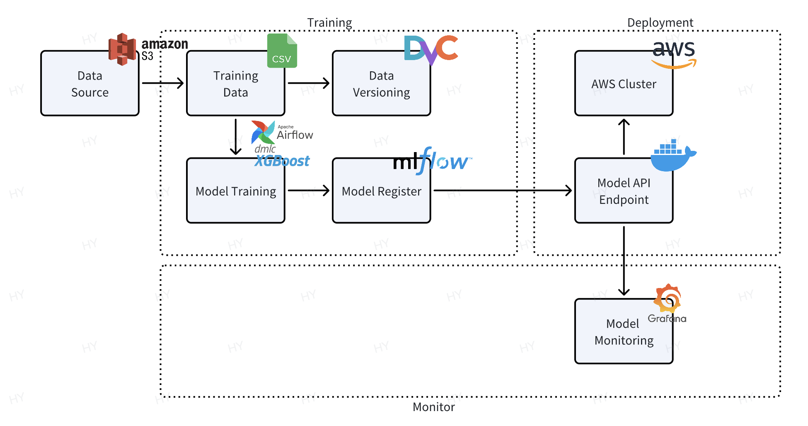

# 🚗 Vehicle Sales Predictor

> Predict future vehicle sales like a pro. This project demonstrates how to build, track, and deploy an end-to-end machine learning pipeline — from raw data to actionable predictions.




## ✨ Features

- Data Source: CSV/Parquet from local, S3, or database. use DVC for data version.
- Airflow DAG: Orchestrates data loading, training, and model registration
- XGBoost Training Container: Trains model and logs to MLflow (optional)
- MLflow Tracking + Registry: Logs metrics/artifacts and handles model versioning
- Model Server (FastAPI): Serves model via REST API
- Client or BI Tool: Queries predictions for business usage


## 🛠️ Setup
```shell
# Clone the repo
git clone https://github.com/hongyingyue/vehicle-sales-predictor.git
cd vehicle-sales-predictor

# Set up your virtual environment (recommended)
uv venv .venv
source .venv/bin/activate  # or .venv\Scripts\activate on Windows

# Install dependencies
uv pip install -r requirements.txt
```


## 🚀 Getting Started

Dataset:
- Downloaded from [kaggle](https://www.kaggle.com/datasets/brendayue/china-vehicle-sales-data)


Train model:
```shell
cd examples
python run_train.py
```

Make prediction server with the trained model:
```shell
python app.py
```

Track your experiments:
```
mlflow ui
```

[vehicle-ml](https://pypi.org/project/vehicle-ml/) package has been released:
```
pip install vehicle-ml
```


## 🔄 Airflow Integration

The project includes an automated ML pipeline using Apache Airflow 3.0.1. The pipeline handles data preprocessing, model training, and evaluation in a production environment.

### Setting up Airflow

1. Install Airflow and dependencies:
```bash
cd airflow
pip install -r requirements.txt
```

2. Configure Airflow environment:
```bash
export AIRFLOW_HOME=$(pwd)
export AIRFLOW__CORE__LOAD_EXAMPLES=False
airflow standalone
```

### Running the Pipeline

1. Access the Airflow web interface at `http://localhost:8080`
2. Navigate to the "vehicle_sales_ml_pipeline" DAG
3. Trigger the pipeline manually or set up a schedule

The pipeline includes:
- Data preprocessing
- Model training with MLflow tracking
- Model evaluation and metadata generation
- Automated model deployment

### Monitoring

- Track pipeline progress through the Airflow web interface
- View model metrics and artifacts in MLflow
- Access model metadata in the `models` directory
